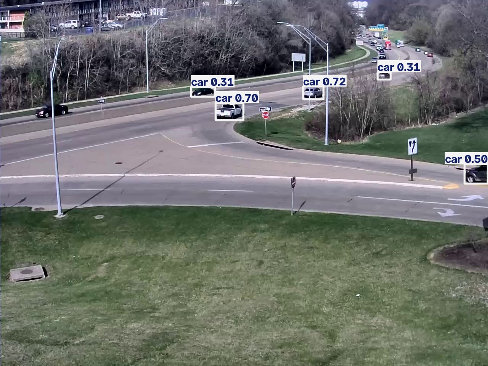

# RoadWatch AI
A Python project that detects and tracks cars, buses, and trucks in recorded traffic videos using YOLO11n and ByteTrack, and counts crossings of a fixed line segment.
## Demo

The preview shows vehicle detections in one frame. The project also supports tracking IDs, directional line-crossing events, and video demos with running counters.
## Project goal
Build a traffic analysis system that tracks vehicles and counts how many travel in each direction.
The current version supports detection, tracking, and line-crossing counting. Counts refer to left-to-right and right-to-left movement across a configured segment, not turning movements. Tracking errors can cause missed or duplicate counts.
## Setup
Install Python 3.13, open the project folder in VS Code, and run these commands in its PowerShell terminal:
```powershell
py -3.13 -m venv .venv
.\.venv\Scripts\python.exe -m pip install -r requirements-lock.txt
```
Skip these installation steps if your project environment is already set up.
The lock file records the Windows environment used for this project.
## Prepare a video
The full dataset is not included in this repository.
For the default example, place `cam_1.mp4` from the AI City 2021 vehicle-counting dataset in:
```text
data/videos/cam_1.mp4
```
Keep the dataset's license documents with your local copy.
You can also use another local traffic video you have permission to process.
## Run detection
Process the first 10 seconds of the default video:
```powershell
.\.venv\Scripts\python.exe src\detect.py --seconds 10
```
To use your own video:
```powershell
.\.venv\Scripts\python.exe src\detect.py --source "D:\traffic\sample.mp4" --seconds 10
```
To change the confidence threshold:
```powershell
.\.venv\Scripts\python.exe src\detect.py --seconds 10 --conf 0.5
```
The first run downloads the pretrained model if it is not already present. CPU processing is the default.
## Output files
Each run creates a separate folder inside `outputs/`.
| File | Contents |
|---|---|
| `annotated.mp4` | Video with detection boxes and labels |
| `first_frame.jpg` | Preview of the first processed frame |
| `detections.csv` | Class, confidence, timestamp, and box coordinates |
| `summary.json` | Run settings, frame count, and processing time |
Detection rows are not unique vehicle counts: the same vehicle can appear in many frames.
## Project structure
```text
roadwatch-ai/
├── README.md
├── ROADMAP.md
├── requirements.txt
├── requirements-lock.txt
├── docs/
│   └── demo/
│       └── detection-preview.jpg
├── src/
│   └── detect.py
├── data/       # Local input videos and dataset references
├── models/     # Downloaded model weights
└── outputs/    # Generated results
```
The environment, dataset, model weights, and generated outputs are excluded from Git. The selected demo screenshot is included.
## Current limitations
- Tracking and directional counting are not implemented yet.
- Small, distant, or partially hidden vehicles may be missed.
- Vehicle classes can be predicted incorrectly.
- Confidence scores are not measured accuracy.
- Processing speed depends on the hardware and video settings.
## Next steps
1. Review detection errors across different traffic conditions.
2. Add tracking IDs across frames.
3. Implement directional counting.
4. Evaluate counts against manually checked events.
See `ROADMAP.md` for the detailed plan.
## References
- [Ultralytics prediction documentation](https://docs.ultralytics.com/modes/predict/)
- Dataset instructions and license documents supplied with the original dataset.
## Tracking and counting

Run a 60-second tracking experiment:

```powershell
python src\track.py --seconds 60 --conf 0.10
```

The command prints its results folder. Set `$run` to that path.
The path below is an example from a previous local run:

```powershell
$run = "outputs\cam_1_1789985894623330300"
python src\count_crossings.py --source "$run\detections.csv"
python src\render_counting_demo.py --run "$run" --output "$run\counting_demo.mp4"
```

The counting segment is configured for cam_1 at x=600,
between y=200 and y=340. Other camera views need a suitable
segment configured in both the counter and renderer.

The reviewed 60-second run recorded 40 automated crossings.
A provisional visual review estimated 49 crossings.
This is a development result from one camera, not a general
accuracy benchmark.